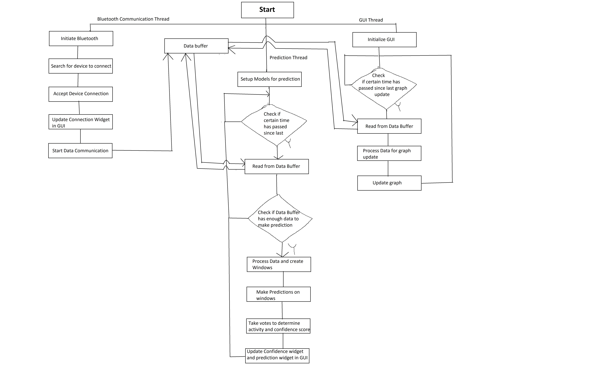

# Human Activity Recognition with smartphone sensors
In this project, A system was developed to collect smartphone IMU data in realtime and predict peformed activities from it.

## Description
The system consists of 2 important parts:

### Sensor data streaming and processing 
Sensor data from smartphone was streamed in realtime using a custom made android application. The app used bluetooth to establish connection and transfer data to the PC. 
A python program was written using the pybluez library that maintained connection with the app and stored data in a buffer. The data was processed and fed to the deep-learning model to predict performed activity. 

### Graphical User Interface (GUI)
A Graphical User Interface (GUI) was built using python library PyQt5 for the sytem.

*Add flowchart*
*Add GIF of project* 

## Dependencies 
Data processing: numpy, matplotlib, pandas, pickle

GUI: PyQt5, pyqtgraph 

Machine learning: sklearn, tensorflow, keras

Bluetooth: pybluez

## Download and Usage
App link: https://github.com/saidulK/bluetooth_data_streamer
1. Download the app and pair smartphone with the PC. 
2. Download this repo
3. Install dependencies
4. Run GUI_predictor.py
5. Open app 
